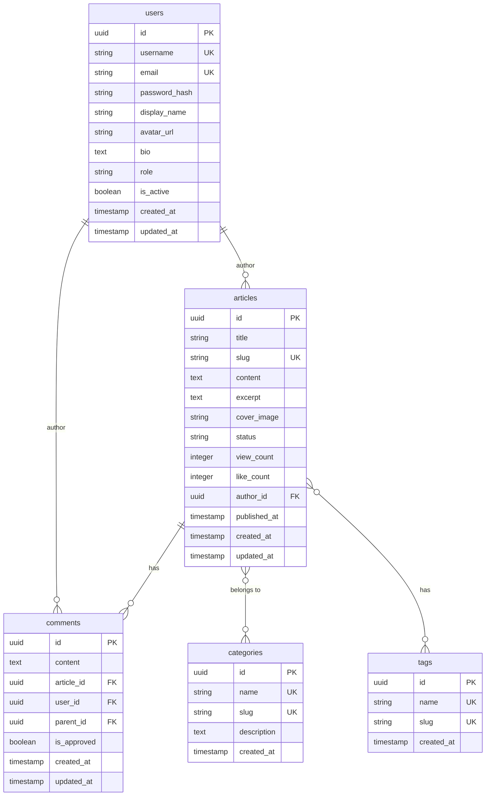

# 后端项目架构文档

## 文档概述

本文档描述了个人博客项目后端服务的整体架构设计、技术选型、代码组织规范以及开发指南。

---

## 1. 架构设计原则

### 1.1 核心原则
- **分层架构**: 清晰的关注点分离
- **单一职责**: 每个模块/函数只做一件事
- **开闭原则**: 对扩展开放，对修改关闭
- **依赖倒置**: 依赖抽象，不依赖具体实现

### 1.2 设计模式
- **Repository Pattern**: 数据访问抽象层
- **Service Pattern**: 业务逻辑封装
- **Middleware Pattern**: 请求处理管道
- **Factory Pattern**: 对象创建抽象
- **Strategy Pattern**: 算法/策略封装

---

## 2. 技术栈选型

### 2.1 核心框架
| 技术 | 版本 | 用途 | 理由 |
|------|------|------|------|
| Node.js | 18+ | 运行时 | LTS版本，稳定可靠 |
| Express.js | 5.x | Web框架 | 轻量、灵活、生态丰富 |
| TypeScript | 5.x | 开发语言 | 类型安全、更好的开发体验 |

### 2.2 数据库层
| 技术 | 用途 | 状态 |
|------|------|------|
| PostgreSQL | 主数据库 | 待接入 |
| Redis | 缓存/会话存储 | 待接入 |
| Prisma/TypeORM | ORM工具 | 待选择 |

### 2.3 安全与工具
| 类别 | 技术 | 用途 |
|------|------|------|
| 身份验证 | JWT + bcryptjs | 用户认证与授权 |
| 输入验证 | Joi + express-validator | 请求数据验证 |
| 日志记录 | Winston | 结构化日志 |
| 测试框架 | Jest + Supertest | 单元与集成测试 |
| 代码质量 | ESLint + Prettier | 代码规范与格式化 |

---

## 3. 项目结构规范

### 3.1 目录结构
```
backend/
├── src/
│   ├── config/          # 应用配置
│   │   ├── database.ts  # 数据库配置
│   │   ├── logger.ts    # 日志配置
│   │   └── redis.ts     # Redis配置
│   ├── controllers/     # 控制器层
│   │   ├── auth.controller.ts
│   │   ├── article.controller.ts
│   │   └── comment.controller.ts
│   ├── middlewares/     # 中间件层
│   │   ├── auth.middleware.ts
│   │   ├── validation.middleware.ts
│   │   └── error.middleware.ts
│   ├── services/        # 业务逻辑层
│   │   ├── auth.service.ts
│   │   ├── article.service.ts
│   │   └── comment.service.ts
│   ├── repositories/    # 数据访问层
│   │   ├── user.repository.ts
│   │   ├── article.repository.ts
│   │   └── comment.repository.ts
│   ├── models/          # 数据模型
│   │   ├── user.model.ts
│   │   ├── article.model.ts
│   │   └── comment.model.ts
│   ├── routes/          # 路由定义
│   │   ├── auth.routes.ts
│   │   ├── article.routes.ts
│   │   └── index.ts
│   ├── utils/           # 工具函数
│   │   ├── AppError.ts
│   │   ├── apiResponse.ts
│   │   └── validators.ts
│   ├── types/           # TypeScript类型定义
│   │   ├── express.d.ts
│   │   └── global.d.ts
│   ├── app.ts           # Express应用配置
│   └── server.ts        # 服务器入口
├── tests/               # 测试文件
│   ├── unit/           # 单元测试
│   ├── integration/    # 集成测试
│   └── e2e/            # 端到端测试
├── docs/               # 项目文档
├── scripts/            # 构建/部署脚本
└── dist/               # 编译输出
```

### 3.2 各层职责

#### 控制器层 (Controllers)
- 处理HTTP请求和响应
- 调用相应的服务层方法
- 不包含业务逻辑

```typescript
// 示例：文章控制器
export class ArticleController {
  async getArticles(req: Request, res: Response, next: NextFunction) {
    try {
      const articles = await articleService.getArticles(req.query);
      res.json(apiResponse.success(articles));
    } catch (error) {
      next(error);
    }
  }
}
```

#### 服务层 (Services)
- 封装业务逻辑
- 协调多个Repository的操作
- 处理业务规则和验证

```typescript
// 示例：文章服务
export class ArticleService {
  async createArticle(data: CreateArticleDto, userId: string) {
    // 业务逻辑验证
    if (data.title.length < 5) {
      throw new ValidationError('标题至少5个字符');
    }
    
    // 调用Repository
    const article = await articleRepository.create({
      ...data,
      authorId: userId,
      slug: this.generateSlug(data.title)
    });
    
    return article;
  }
}
```

#### 数据访问层 (Repositories)
- 封装数据访问逻辑
- 提供CRUD操作
- 数据库查询优化

```typescript
// 示例：文章Repository
export class ArticleRepository {
  async findWithPagination(options: PaginationOptions) {
    return this.prisma.article.findMany({
      skip: (options.page - 1) * options.limit,
      take: options.limit,
      include: { author: true, categories: true },
      orderBy: { createdAt: 'desc' }
    });
  }
}
```

#### 模型层 (Models)
- 定义数据结构和关系
- 数据验证规则
- TypeScript类型定义

```typescript
// 示例：文章模型
export interface Article {
  id: string;
  title: string;
  slug: string;
  content: string;
  authorId: string;
  status: 'draft' | 'published' | 'archived';
  createdAt: Date;
  updatedAt: Date;
}
```

---

## 4. API设计规范

### 4.1 RESTful API设计

#### 资源命名规范
- 使用复数名词：`/articles`, `/comments`, `/users`
- 使用连字符：`/article-categories`
- 避免动词：使用HTTP方法表示操作

#### 端点设计
```
# 文章资源
GET    /api/v1/articles           # 获取文章列表
POST   /api/v1/articles           # 创建文章
GET    /api/v1/articles/:id       # 获取单篇文章
PUT    /api/v1/articles/:id       # 更新整篇文章
PATCH  /api/v1/articles/:id       # 部分更新文章
DELETE /api/v1/articles/:id       # 删除文章

# 嵌套资源
GET    /api/v1/articles/:id/comments  # 获取文章评论
POST   /api/v1/articles/:id/comments  # 创建文章评论

# 过滤、排序、分页
GET    /api/v1/articles?page=1&limit=10&sort=-createdAt&status=published
```

### 4.2 请求/响应规范

#### 请求头
```http
Content-Type: application/json
Authorization: Bearer <token>
X-API-Version: 1.0.0
```

#### 成功响应格式
```json
{
  "success": true,
  "data": {
    // 实际数据
  },
  "meta": {
    "page": 1,
    "limit": 10,
    "total": 100,
    "totalPages": 10
  }
}
```

#### 错误响应格式
```json
{
  "success": false,
  "error": {
    "message": "Validation failed",
    "code": 422,
    "details": {
      "title": ["Title is required"],
      "content": ["Content must be at least 100 characters"]
    },
    "timestamp": "2024-01-01T00:00:00.000Z"
  }
}
```

### 4.3 状态码使用
- `200 OK`: 成功请求
- `201 Created`: 资源创建成功
- `204 No Content`: 成功但无返回内容
- `400 Bad Request`: 客户端错误
- `401 Unauthorized`: 未认证
- `403 Forbidden`: 无权限
- `404 Not Found`: 资源不存在
- `409 Conflict`: 资源冲突
- `422 Unprocessable Entity`: 验证失败
- `429 Too Many Requests`: 请求过多
- `500 Internal Server Error`: 服务器错误

---

## 5. 数据库设计

### 5.1 核心实体关系



### 5.2 索引策略
- 主键：所有表使用UUID作为主键
- 外键：所有关联字段建立索引
- 查询字段：slug、status、created_at等常用查询字段建立索引
- 复合索引：根据查询模式建立复合索引

### 5.3 数据迁移
- 使用数据库迁移工具（Prisma Migrate或TypeORM Migrations）
- 每次变更创建独立的迁移文件
- 迁移文件包含up和down操作
- 测试环境使用测试数据填充

---

## 6. 安全架构

### 6.1 身份验证与授权

#### JWT认证流程
1. 用户登录获取access token和refresh token
2. access token短期有效（15分钟）
3. refresh token长期有效（7天），用于获取新的access token
4. 令牌存储在HttpOnly Cookie中

#### 权限控制
```typescript
// 角色定义
export enum UserRole {
  ADMIN = 'admin',
  EDITOR = 'editor',
  USER = 'user',
  GUEST = 'guest'
}

// 权限中间件
export const requireRole = (...roles: UserRole[]) => {
  return (req: Request, res: Response, next: NextFunction) => {
    if (!req.user || !roles.includes(req.user.role)) {
      throw new ForbiddenError('Insufficient permissions');
    }
    next();
  };
};
```

### 6.2 输入验证与清理

#### 请求体验证
```typescript
// 使用Joi定义验证模式
export const createArticleSchema = Joi.object({
  title: Joi.string().min(5).max(255).required(),
  content: Joi.string().min(100).required(),
  categoryIds: Joi.array().items(Joi.string().uuid()).optional(),
  tags: Joi.array().items(Joi.string().max(50)).optional()
});

// 中间件验证
export const validate = (schema: Joi.Schema) => {
  return (req: Request, res: Response, next: NextFunction) => {
    const { error } = schema.validate(req.body);
    if (error) {
      throw new ValidationError(error.message);
    }
    next();
  };
};
```

### 6.3 安全中间件配置

```typescript
// Helmet安全头配置
app.use(helmet({
  contentSecurityPolicy: {
    directives: {
      defaultSrc: ["'self'"],
      styleSrc: ["'self'", "'unsafe-inline'"],
      scriptSrc: ["'self'"],
      imgSrc: ["'self'", "data:", "https:"],
    },
  },
  crossOriginEmbedderPolicy: false,
}));

// CORS配置
app.use(cors({
  origin: process.env.ALLOWED_ORIGINS?.split(',') || [],
  credentials: true,
  optionsSuccessStatus: 200,
}));

// 速率限制
app.use('/api/', apiLimiter);
app.use('/api/auth/', authLimiter);
```

---

## 7. 错误处理与日志

### 7.1 错误处理策略

#### 错误分类
- **操作错误**: 预期的错误（验证失败、资源不存在等）
- **程序错误**: 未预期的错误（bug、系统错误等）

#### 错误处理中间件
```typescript
export const errorHandler = (
  err: Error,
  req: Request,
  res: Response,
  next: NextFunction
) => {
  // 记录错误
  logger.error({
    message: err.message,
    stack: err.stack,
    path: req.path,
    method: req.method,
    ip: req.ip,
    userAgent: req.get('user-agent'),
  });

  // 返回适当的错误响应
  if (err instanceof AppError) {
    return res.status(err.statusCode).json({
      success: false,
      error: formatError(err),
    });
  }

  // 生产环境隐藏内部错误细节
  const isProduction = process.env.NODE_ENV === 'production';
  const message = isProduction ? 'Internal server error' : err.message;
  
  res.status(500).json({
    success: false,
    error: {
      message,
      code: 500,
      timestamp: new Date().toISOString(),
    },
  });
};
```

### 7.2 日志策略

#### 日志级别
- `error`: 应用程序错误
- `warn`: 警告信息
- `info`: 一般信息（启动、关闭等）
- `http`: HTTP请求日志
- `debug`: 调试信息（开发环境）

#### 日志格式
```json
{
  "timestamp": "2024-01-01T00:00:00.000Z",
  "level": "error",
  "message": "Database connection failed",
  "service": "blog-backend",
  "stack": "Error: Connection refused...",
  "context": {
    "database": "postgres",
    "host": "localhost"
  }
}
```

---

## 8. 性能优化

### 8.1 数据库优化
- 使用连接池管理数据库连接
- 实现查询缓存（Redis）
- 优化复杂查询，使用索引
- 分页查询避免全表扫描

### 8.2 API性能
- 实现响应压缩
- 使用ETag进行缓存验证
- 限制响应数据大小
- 实现请求限流

### 8.3 内存管理
- 监控内存使用情况
- 及时释放不再使用的资源
- 避免内存泄漏

---

## 9. 测试策略

### 9.1 测试金字塔
```
        E2E Tests
           / \n          /   \n Integration Tests
          \   /
           \ /
       Unit Tests
```

### 9.2 测试类型
- **单元测试**: 测试单个函数/方法
- **集成测试**: 测试模块间交互
- **E2E测试**: 测试完整API流程
- **性能测试**: 测试API响应时间

### 9.3 测试覆盖率目标
- 语句覆盖率: ≥80%
- 分支覆盖率: ≥70%
- 函数覆盖率: ≥90%
- 行覆盖率: ≥80%

---

## 10. 部署与运维

### 10.1 环境配置
- **开发环境**: 本地开发，热重载
- **测试环境**: 自动化测试，预发布
- **生产环境**: 高可用，监控告警

### 10.2 部署流程
1. 代码提交触发CI/CD流水线
2. 运行测试套件
3. 构建Docker镜像
4. 部署到对应环境
5. 运行健康检查
6. 切换流量（蓝绿部署）

### 10.3 监控指标
- **应用指标**: CPU、内存、请求数、错误率
- **业务指标**: 用户数、文章数、评论数
- **性能指标**: 响应时间、吞吐量、并发数

---

## 11. 开发工作流

### 11.1 Git分支策略
```
main
  ├── develop
  │     ├── feature/article-crud
  │     ├── feature/comment-system
  │     └── hotfix/login-issue
  └── release/v1.0.0
```

### 11.2 代码提交规范
```
feat: 添加新功能
fix: 修复bug
docs: 文档更新
style: 代码格式调整
refactor: 代码重构
test: 测试相关
chore: 构建过程或辅助工具变动
```

### 11.3 代码审查
- 至少一名 reviewer 批准
- 所有测试必须通过
- 代码